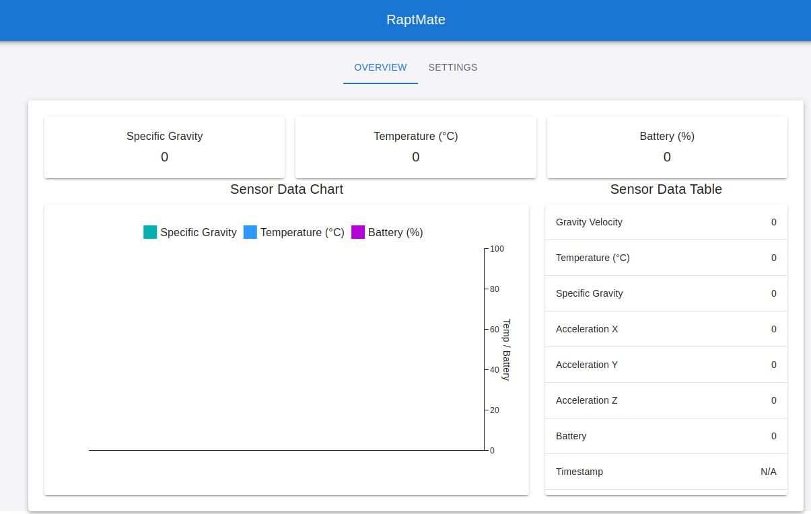

# RAPT-Mate

RAPT-Mate is a project designed to monitor and display sensor data from a BLE-enabled device (RaptPill) using a React-based web interface and an ESP32-based backend. The project integrates hardware and software components to provide real-time data visualization and configuration capabilities.

---

## Features

### Backend (ESP32)
- **BLE Integration**: The ESP32 scans for BLE devices and retrieves sensor data from the RaptPill device.
- **Wi-Fi Configuration**: The ESP32 operates in APSTA mode, allowing it to act as both an access point and a station.
- **HTTP Server**: Serves the React web application and provides REST endpoints for data and settings.
- **SPIFFS Filesystem**: Hosts the React application files on the ESP32's SPIFFS filesystem.
- **mDNS Support**: Makes the device accessible via `raptmate.local`.
- **Time Synchronization**: Periodically syncs time using an NTP server.

### Frontend (React)
- **Real-Time Data Visualization**: Displays sensor data (e.g., gravity velocity, temperature, acceleration, battery) using charts and tables.
- **Configuration Interface**: Allows users to configure Wi-Fi credentials (SSID and password) via a settings tab.
- **Responsive Design**: Built using Material-UI for a clean and user-friendly interface.

---

## How It Works

1. **BLE Data Collection**: The ESP32 scans for BLE devices and retrieves sensor data from the RaptPill device.
2. **Data Serving**: The ESP32 serves the React application and provides REST endpoints for real-time data and configuration.
3. **Frontend Visualization**: The React application fetches data from the ESP32 and displays it in a user-friendly interface.

---

## Build and Flash Instructions

1. Build the project and flash it to the ESP32 board:
   ```bash
   idf.py -p PORT build flash monitor

The partitions used will be flashed automatically from the idf.py.